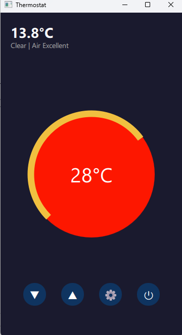

# 🌡️ Smart Thermostat

A modern thermostat application built with Qt QML and C++.

## ✨ Features
- Display and control indoor temperature
- Dynamic color indicator (blue / orange / red)
- Animated arc showing temperature level
- Real-time outdoor temperature from OpenWeatherMap API
- Custom city selection via settings
- Power off button

## 🛠️ Built With
- Qt 6 / QML
- C++
- OpenWeatherMap API

## ⚙️ Setup
1. Clone the repository
2. Create `config.h` in the project root:
```cpp
#define WEATHER_API_KEY "your_api_key_here"
```
3. Open in Qt Creator and build

## 📸 Screenshot
